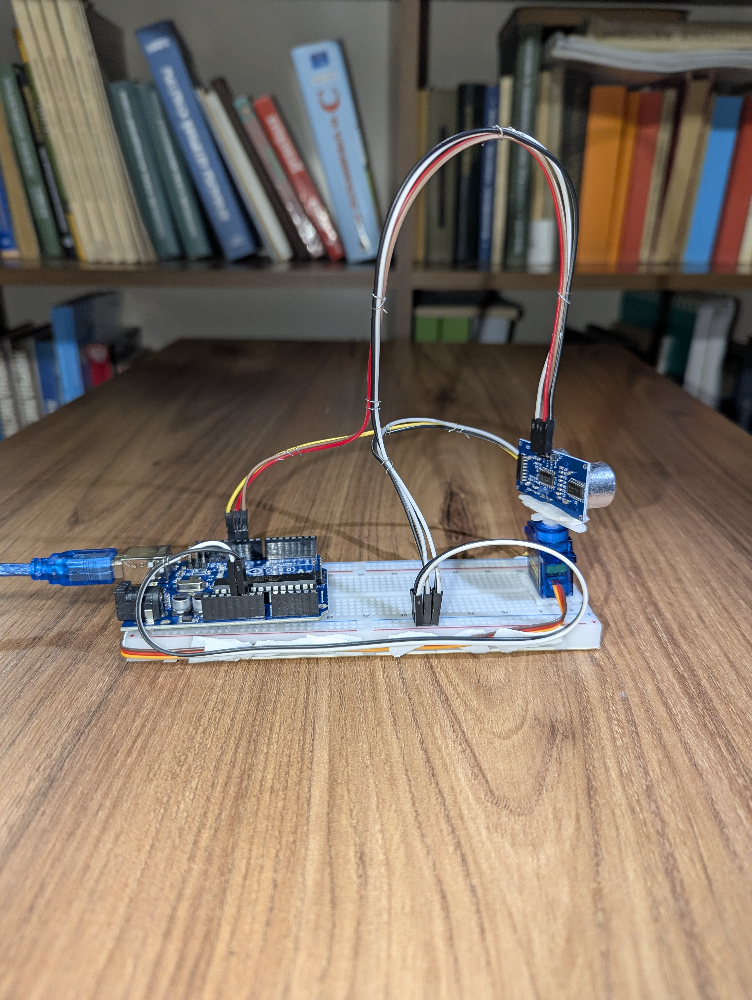
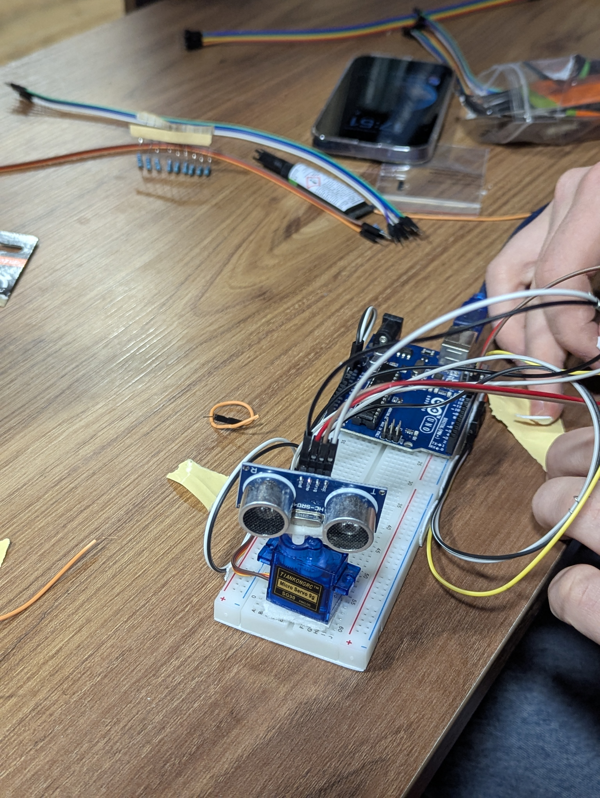
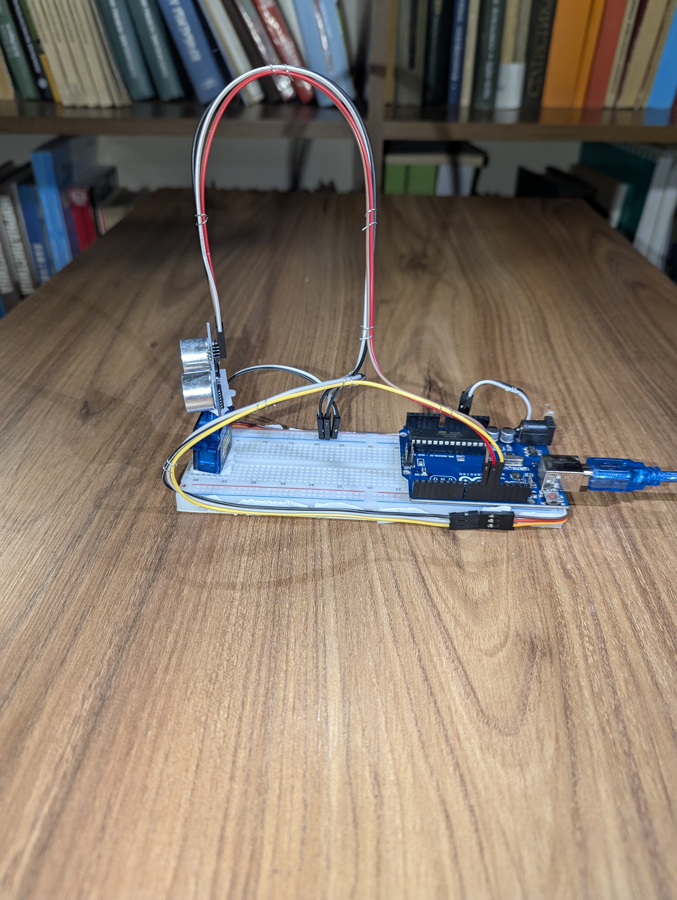
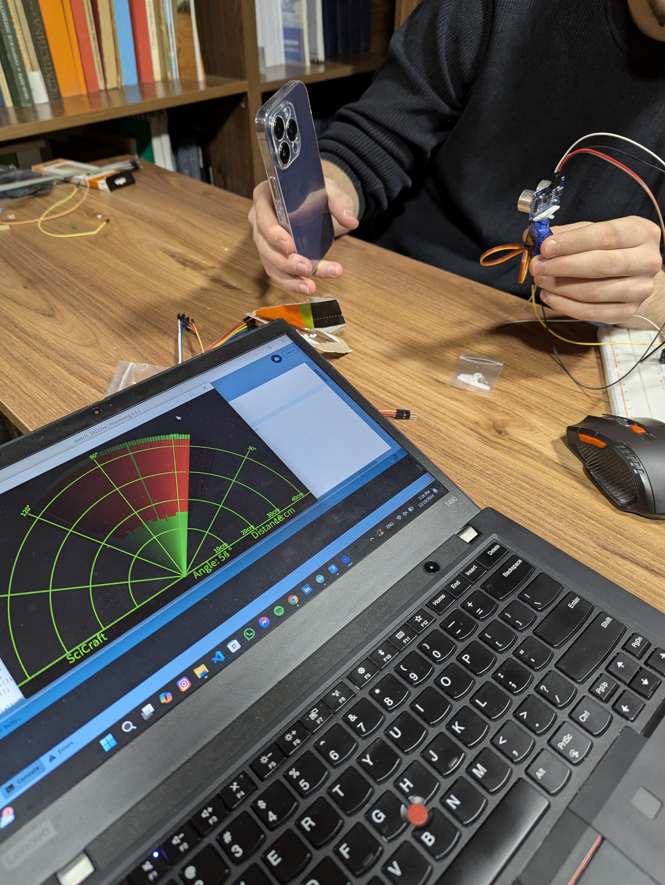

# Arduino Ultrasonic Radar

An Arduino-based ultrasonic radar system built using an **Arduino Uno**, **HC-SR04 ultrasonic sensor**, and **servo motor**.

The system scans a 180° area, measures the distance to nearby objects, and sends angle and distance data to a computer. A **Processing-based radar visualization** displays the detected objects in real time.

---

## Project Overview

This project was developed as a **group project** for a university Arduino class.

The goal was to create a simple radar-like system that combines hardware, sensors, servo control, serial communication, and real-time visualization.

The system consists of:

- **Arduino Uno** — controls the ultrasonic sensor and servo motor
- **HC-SR04 Ultrasonic Sensor** — measures the distance to nearby objects
- **Servo Motor** — rotates the ultrasonic sensor across the scanning area
- **Breadboard & Jumper Wires** — connect the electronic components
- **Processing Application** — receives serial data and displays the radar interface

The ultrasonic sensor is mounted on the servo motor. As the servo rotates, the Arduino measures the distance to objects at different angles.

The Arduino then sends the angle and distance data to the computer through a USB serial connection. The Processing application converts this information into a real-time radar-style visualization.

---

## Project Gallery

### Hardware Setup



### Circuit and Connections





### Radar Visualization



---

## Features

- 180° ultrasonic scanning
- Automatic servo movement
- Real-time distance measurement
- Angle-based object detection
- Serial communication between Arduino and computer
- Processing-based radar visualization
- Real-time object mapping
- Low-cost hardware prototype

---

## Technologies Used

- Arduino Uno
- HC-SR04 Ultrasonic Sensor
- Servo Motor
- Breadboard
- Jumper Wires
- Arduino IDE
- Processing
- Serial Communication
- Embedded Systems Prototyping

---

## Components

| Component | Quantity |
|---|---:|
| Arduino Uno | 1 |
| HC-SR04 Ultrasonic Sensor | 1 |
| Servo Motor | 1 |
| Breadboard | 1 |
| Jumper Wires | Several |
| USB Cable | 1 |
| Computer | 1 |

---

## How It Works

The system consists of two main parts:

1. **Hardware scanning**
2. **Radar visualization**

### 1. Hardware Scanning

The servo motor rotates the HC-SR04 ultrasonic sensor across a defined angle range.

At each angle:

1. The Arduino positions the servo.
2. The HC-SR04 sends an ultrasonic pulse.
3. The pulse travels toward an object.
4. The pulse reflects from the object.
5. The sensor receives the returning echo.
6. The Arduino measures the echo time.
7. The distance is calculated.
8. The angle and distance are sent to the computer.

### 2. Radar Visualization

The computer receives the data through the Arduino's serial connection.

The transmitted data contains two main values:

```text
Angle + Distance
```

For example:

```text
30° → 45 cm
60° → 72 cm
90° → 35 cm
120° → 80 cm
```

The Processing application uses these measurements to display detected objects on a radar-style interface.

---

## Radar Map

The radar interface visualizes the area scanned by the ultrasonic sensor.

The display includes:

- Radar grid
- Angle indicators
- Distance markers
- Moving scanning line
- Detected objects
- Real-time distance information

As the servo rotates, the scanning line moves across the radar display. When an object is detected, its approximate position is displayed based on the measured angle and distance.

The coordinates can be represented using:

```text
X = Distance × cos(angle)
Y = Distance × sin(angle)
```

This converts the polar angle and distance measurements into approximate positions on the radar display.

---

## Data Communication

The Arduino communicates with the computer through a USB serial connection.

The Arduino can send data in a format such as:

```text
0,85
10,82
20,79
30,45
40,52
50,68
```

Where:

```text
angle,distance
```

For example:

```text
30,45
```

means that an object was detected approximately **45 cm away at an angle of 30°**.

The Processing application reads this data and updates the radar visualization in real time.

---

## Distance Calculation

The approximate distance is calculated using the speed of sound:

```text
Distance = (Echo Time × Speed of Sound) / 2
```

The division by two is necessary because the ultrasonic pulse travels from the sensor to the object and then returns to the sensor.

---

## Wiring

A typical connection for this type of setup is shown below.

### HC-SR04 → Arduino Uno

| HC-SR04 Pin | Arduino Uno |
|---|---|
| VCC | 5V |
| GND | GND |
| TRIG | Digital Pin 10 |
| ECHO | Digital Pin 11 |

### Servo Motor → Arduino Uno

| Servo Wire | Arduino Uno |
|---|---|
| Signal | Digital Pin 9 |
| VCC | 5V |
| GND | GND |

> **Note:** The original source code is no longer available, so the exact pin configuration used in the original project may have been different.

---

## Software

### Arduino

The Arduino side of the project was created using:

- Arduino IDE
- Arduino Servo library
- Serial communication

The Arduino program controlled the servo motor, measured distance using the HC-SR04 sensor, and sent the results to the computer.

### Processing

The radar visualization was created using **Processing**.

The Processing application received angle and distance data from the Arduino and displayed it on a radar-style interface.

The interface included:

- Moving radar sweep
- Angle information
- Distance information
- Range markers
- Detected object visualization

> **Note:** The original Arduino and Processing source code used during the university project is no longer available. This repository documents the original project using photographs and project information. Reconstructed source code may be added later.

---

## Installation

If reconstructed source code is added to this repository, the project can be set up as follows.

### 1. Clone the Repository

```bash
git clone https://github.com/LukaTonia/ArduinoProject.git
```

### 2. Open the Arduino Project

Open the `.ino` file in the Arduino IDE.

Select:

```text
Tools → Board → Arduino Uno
```

Then select the correct USB/COM port.

### 3. Upload the Arduino Code

Connect the Arduino Uno to the computer using a USB cable and upload the sketch.

### 4. Run the Processing Visualization

Open the Processing radar visualization file and select the correct serial port.

### 5. Start Scanning

Once the Arduino and Processing application are connected, the servo rotates the sensor and the radar display updates with incoming measurements.

---

## Example Radar Data

Example serial data:

```text
Angle: 0°   Distance: 85 cm
Angle: 10°  Distance: 82 cm
Angle: 20°  Distance: 79 cm
Angle: 30°  Distance: 45 cm
Angle: 40°  Distance: 52 cm
```

The visualization application converts this information into a graphical radar representation.

---

## Team Project

This project was completed collaboratively as part of a university course.

The team worked together on:

- Hardware assembly
- Sensor integration
- Arduino programming
- Servo motor control
- Serial communication
- Testing and debugging
- Radar visualization

---

## What We Learned

This project provided practical experience with:

- Arduino programming
- Ultrasonic distance measurement
- Servo motor control
- Serial communication
- Sensor integration
- Breadboard prototyping
- Real-time data visualization
- Hardware and software integration
- Team collaboration

---

## Applications

The concepts demonstrated in this project can be applied to:

- Object detection
- Robotics
- Obstacle detection
- Distance measurement
- Embedded systems
- Sensor visualization
- Autonomous systems
- Real-time monitoring

---

## Limitations

The system has several practical limitations:

- Ultrasonic measurements can be affected by object shape and surface material.
- Small or angled objects may be difficult to detect.
- The HC-SR04 has a limited measurement range.
- Servo movement introduces a delay between measurements.
- The system uses only one ultrasonic sensor.
- The radar visualization provides an approximate representation rather than a precise 2D map.

---

## Future Improvements

Possible improvements include:

- Reconstructing the original Arduino source code
- Reconstructing the Processing radar visualization
- Improving measurement filtering
- Improving object detection accuracy
- Adding multiple ultrasonic sensors
- Increasing scanning speed
- Adding data logging
- Improving the graphical interface
- Adding object tracking
- Creating a more advanced 2D mapping system

---

## Authors

This project was developed collaboratively by:

- **Luka Tonia** — [GitHub Profile](https://github.com/LukaTonia)
- **Levan Japaridze** — [GitHub Profile](https://github.com/Japo8)

---

## Academic Context

**University Arduino Project**

Developed as part of a university Arduino and embedded systems class.

---

## License

This project is provided for educational and portfolio purposes.

You may use or modify the project for learning and academic purposes.
